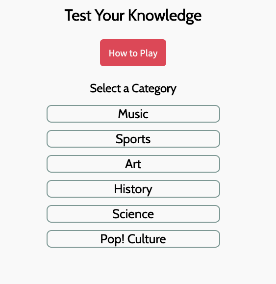
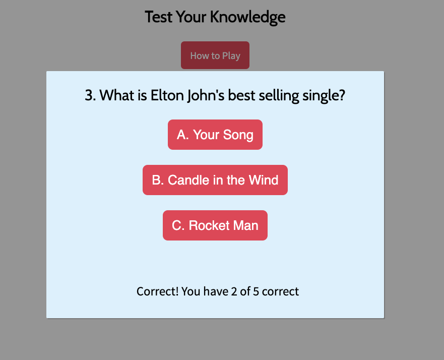

# seir-323-project-1

## Description

My first project in General Assembly's Software Engineering Immersive was to build a game. I chose to build a trivia game because I love trivia and thought it would be fun to test people's knowledge in a variety of different categories.

You can use this trivia game to have fun and test your own knowledge, or build upon what I created (adding more questions, functionality, design, etc.).

The problem this project solves is that a lot of trivia games usually focus on one topic. I wanted to give my users a chance to shine in their preferred category or have them see how far they could go in a subject they are not too familiar with.

[Play the Game here]: https://kristenmoran.github.io/seir-323-project-1/

## Example

Trivia Game in Browser

Gameplay 

## Features/User Stories

Bronze Features

- 1 general knowledge game that tracked correct answers

Silver Features

- 6 separate category game that tracked correct answers
- Option to leave the game by clicking out of the question display area
- Responsive Styling
- How to play Modal

Gold Features

- 6 categories with timer
- A tracker of best scoring category
- Refactored code

I completed my Silver Category. My goal is to eventually add a timer and refactor the code.

## Technologies Used

- HTML 5, CSS 3, JavaScript

## Installation

Install seir-323-project-1 by:

    1. Fork the repository
    2. Clone the repository
    3. Start the game locally
    4. Add/enhance features and technologies!

## Contribute

Source Code: https://github.com/kristenmoran/seir-323-project-1
Issue Tracker: https://github.com/kristenmoran/seir-323-project-1/issues
